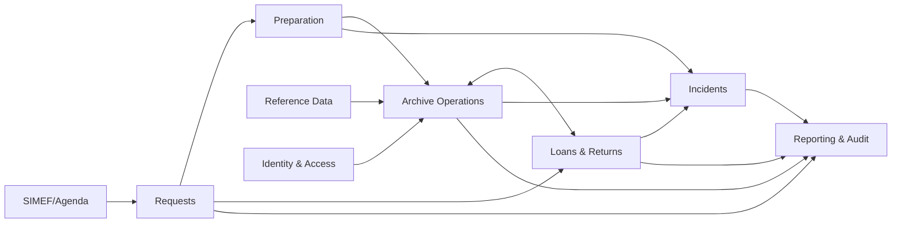

# DDD-004 — Context Map

```mermaid
flowchart LR
 SIMEF[SIMEF/Agenda] --> REQ[Requests]
 REQ --> PREP[Preparation]
 PREP --> ARCH[Archive Operations]
 REQ --> LOAN[Loans & Returns]
 ARCH <--> LOAN
 ARCH --> INC[Incidents]
 PREP --> INC
 LOAN --> INC
 REF[Reference Data] --> ARCH
 IAM[Identity & Access] --> ARCH
 ARCH --> REP[Reporting & Audit]
 REQ --> REP
 LOAN --> REP
 INC --> REP
```
