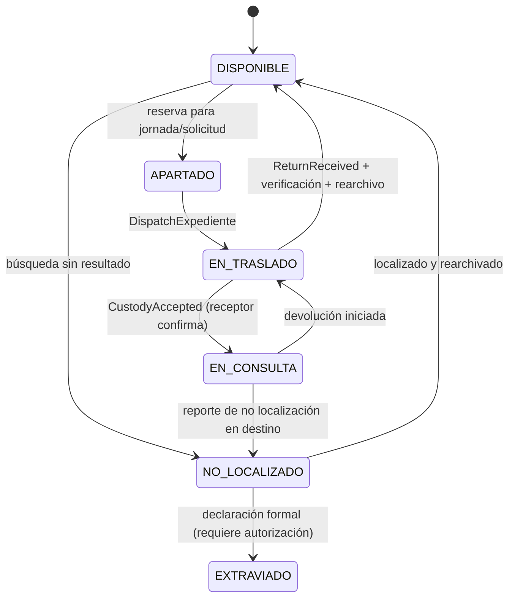
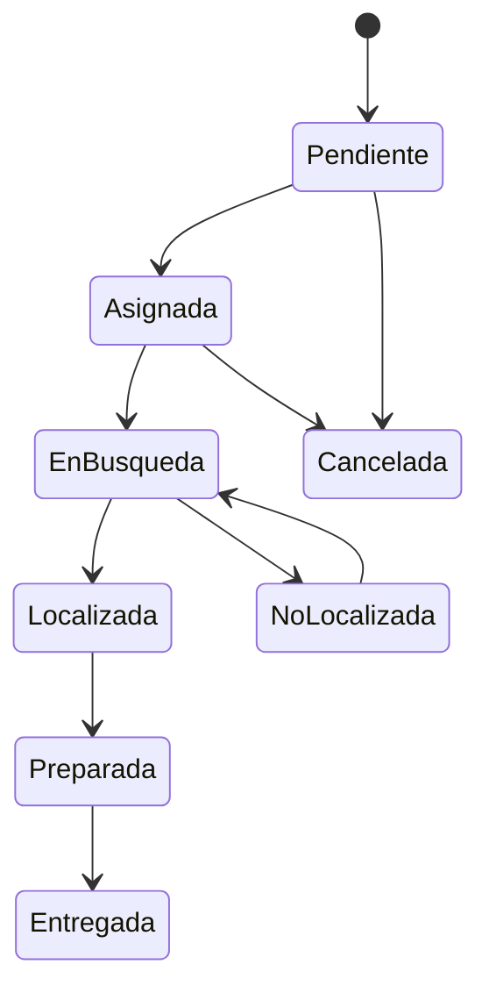
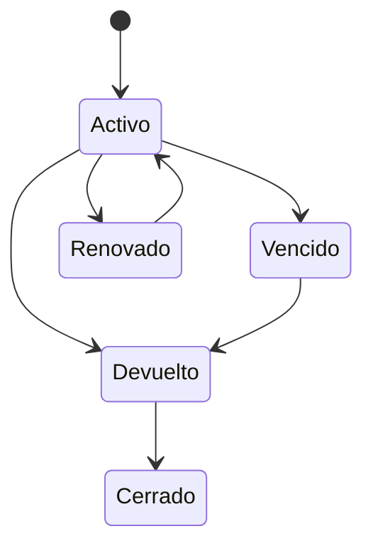

# DDD-012 — State Machines

## ImportacionAgenda (IMP-AP-001..014)

`BUILDING → FINALIZED` es la única transición interna de T-02. Outcome y métricas son
nulos durante construcción y se fijan una vez en `finalize(outcome)`. No hay reapertura.
El layout incompatible se rechaza antes de construir el Aggregate y no es un estado.

## Cita de Agenda Preparation (AGD-AP-001..009)

```text
ACTIVA --ausente de snapshot--> RETIRADA_DE_AGENDA
RETIRADA_DE_AGENDA --mismo FOLIO reaparece--> ACTIVA
```

`ACTIVA` participa en preparación vigente. `RETIRADA_DE_AGENDA` conserva Entity, FOLIO y
último contenido funcional; no es cancelación clínica. No existen otros estados ni
timestamps de lifecycle en T-03.

## EstadoOperativo del Expediente (DEC-EW-STATE-001 ACCEPTED)



**Notas obligatorias:**
- `EN_BUSQUEDA` **no** es un valor de `EstadoOperativo`. Es el estado de la **Solicitud**.
- `PRESTADO` **no** es un valor de `EstadoOperativo`. Pertenece al aggregate **Préstamo**.
- `NO_LOCALIZADO ≠ EXTRAVIADO`. La transición requiere proceso formal.
- La vuelta a `DISPONIBLE` requiere devolución + verificación + rearchivo confirmados.
  Recibir físicamente el expediente **no** equivale a rearchivarlo (BR-005, INV-LOAN-002).
- Las transiciones de `EstadoOperativo` pueden reaccionar a eventos de otros aggregates.

## Solicitud


## Préstamo

