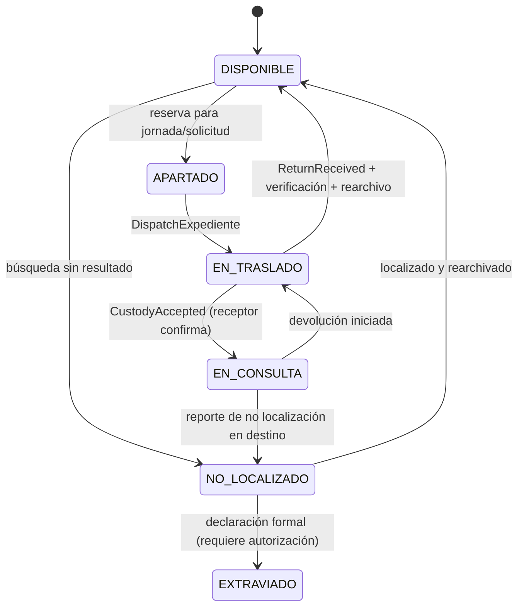
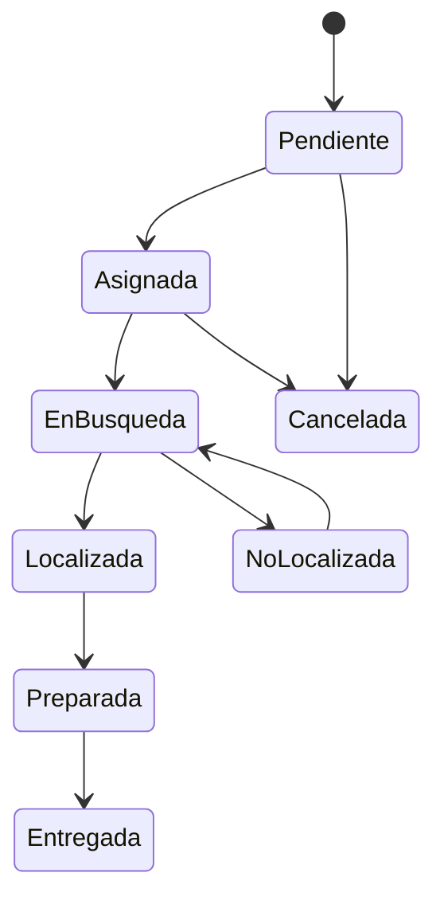
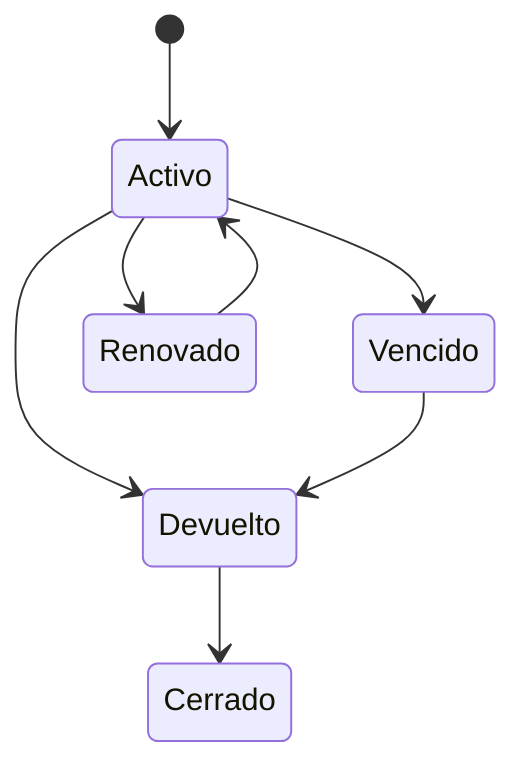

# DDD-012 — State Machines

## EstadoOperativo del Expediente (DEC-EW-STATE-001 ACCEPTED)

**Notas obligatorias:**
- `EN_BUSQUEDA` **no** es un valor de `EstadoOperativo`. Es el estado de la **Solicitud**.
- `PRESTADO` **no** es un valor de `EstadoOperativo`. Pertenece al aggregate **Préstamo**.
- `NO_LOCALIZADO ≠ EXTRAVIADO`. La transición requiere proceso formal.
- La vuelta a `DISPONIBLE` requiere devolución + verificación + rearchivo confirmados.
  Recibir físicamente el expediente **no** equivale a rearchivarlo (BR-005, INV-LOAN-002).
- Las transiciones de `EstadoOperativo` pueden reaccionar a eventos de otros aggregates.

## Solicitud

## Préstamo

