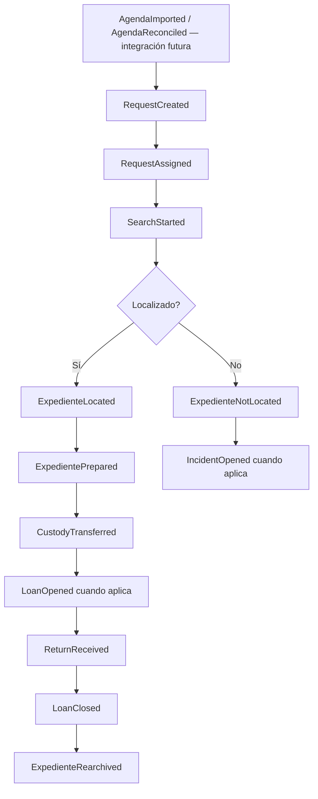

# DDD-022 — Domain Event Flow

AGD-AP-007 difiere `AgendaReconciled` para T-03. Este diagrama conserva únicamente una
integración conceptual futura y no autoriza emisión ni creación de Solicitud en el slice.
