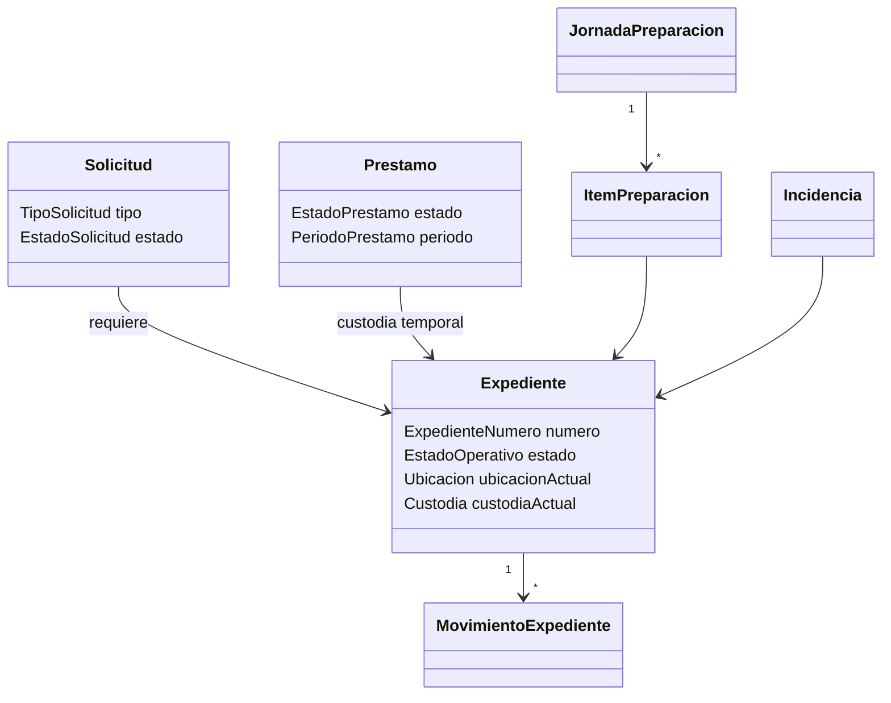

# DDD-028 — Conceptual Domain Diagram

```mermaid
classDiagram
 class Expediente {
   ExpedienteNumero numero
   EstadoOperativo estado
   Ubicacion ubicacionActual
   Custodia custodiaActual
 }
 class Solicitud {
   TipoSolicitud tipo
   EstadoSolicitud estado
 }
 class Prestamo {
   EstadoPrestamo estado
   PeriodoPrestamo periodo
 }
 class JornadaPreparacion
 class ItemPreparacion
 class Incidencia
 class MovimientoExpediente
 Solicitud --> Expediente : requiere
 Prestamo --> Expediente : custodia temporal
 JornadaPreparacion "1" --> "*" ItemPreparacion
 ItemPreparacion --> Expediente
 Incidencia --> Expediente
 Expediente "1" --> "*" MovimientoExpediente
```
Diagrama conceptual; no es ERD.
