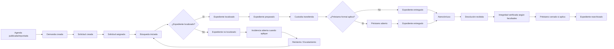

# ES-001 — Big Picture Event Storming

## Hotspots principales
- diferencia entre entrega y préstamo;
- inicio exacto de custodia externa;
- momento en que “no localizado” escala;
- definición de TOMO/Provisional;
- tratamiento de citas añadidas después de preparación.
