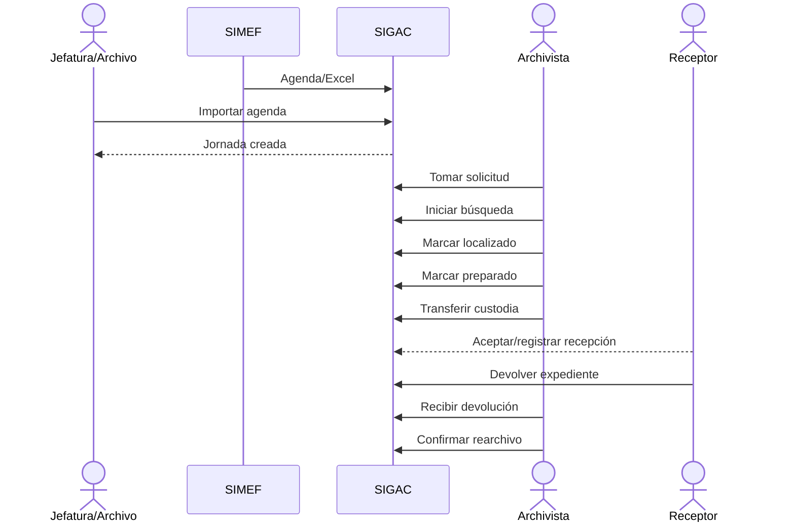

# End-to-End Sequence

```mermaid
sequenceDiagram
 actor J as Jefatura/Archivo
 participant S as SIMEF
 participant G as SIGAC
 actor A as Archivista
 actor R as Receptor

 S->>G: Agenda/Excel
 J->>G: Importar agenda
 G-->>J: Jornada creada
 A->>G: Tomar solicitud
 A->>G: Iniciar búsqueda
 A->>G: Marcar localizado
 A->>G: Marcar preparado
 A->>G: Transferir custodia
 R-->>G: Aceptar/registrar recepción
 R->>G: Devolver expediente
 A->>G: Recibir devolución
 A->>G: Confirmar rearchivo
```
