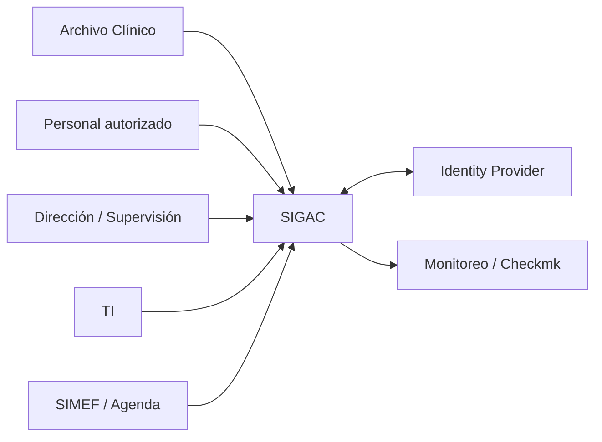

# ARC-003 — C4 System Context

```mermaid
flowchart LR
  U1[Archivo Clínico]
  U2[Personal autorizado]
  U3[Dirección / Supervisión]
  U4[TI]
  S[SIGAC]
  A[SIMEF / Agenda]
  IDP[Identity Provider]
  MON[Monitoreo / Checkmk]

  U1 --> S
  U2 --> S
  U3 --> S
  U4 --> S
  A --> S
  S <--> IDP
  S --> MON
```

SIGAC es un sistema de gestión operativa del archivo clínico físico. No sustituye al HIS/ECE.
