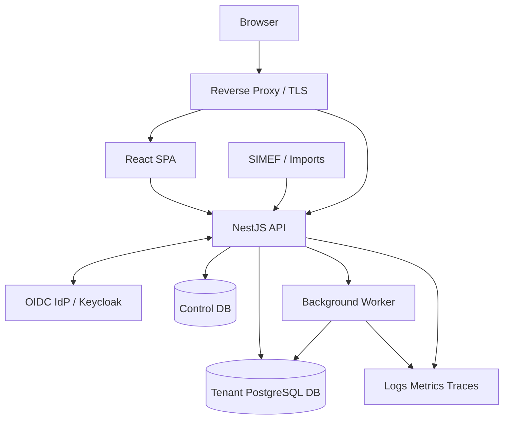

# ARC-004 — C4 Container Architecture

## Container responsibilities
- Web: experiencia de usuario.
- API: casos de uso, dominio y adapters.
- Worker: outbox, importaciones pesadas y tareas programadas.
- Control DB: tenants, routing y configuración global mínima.
- Tenant DB: datos de negocio de un hospital.
