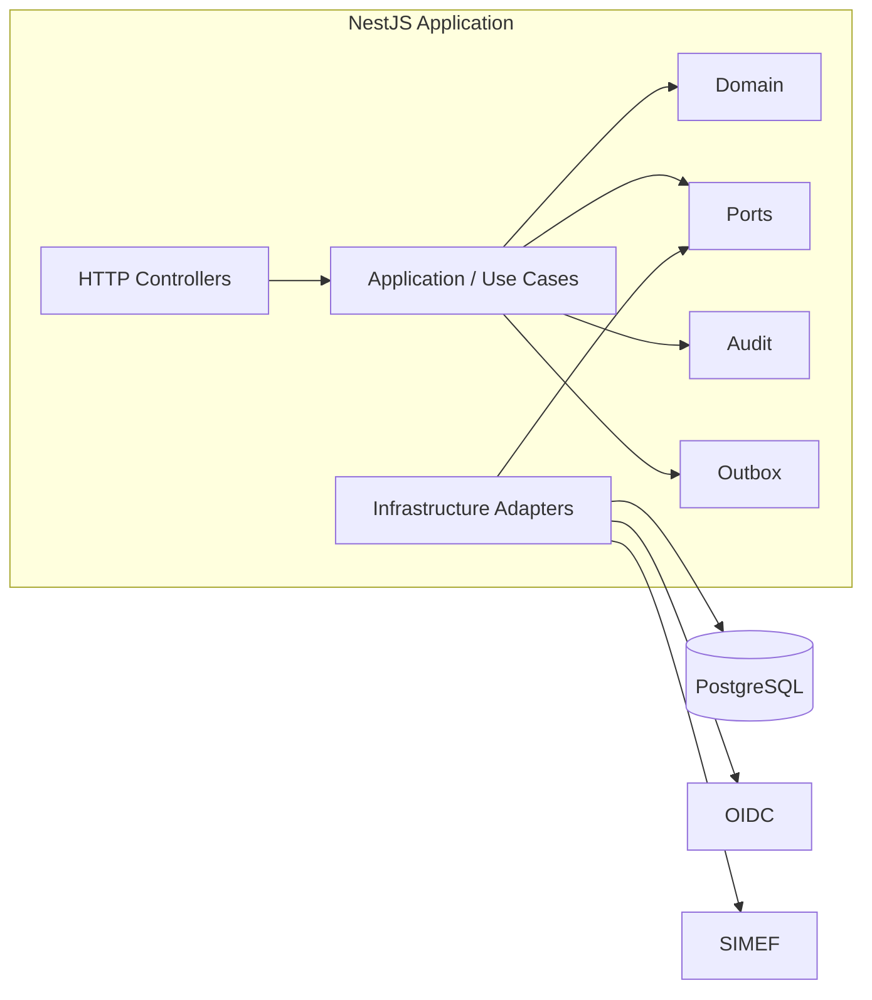

# ARC-005 — Backend Component Architecture

## Expediente Workspace read model

`GetExpediente` es el compositor server-side de un único `ExpedienteReadModel`.
Application de Expediente Workspace posee los query ports mínimos que consume de
Requests, Loans & Returns e Incidents; estos contratos retornan proyecciones, no
aggregates. El frontend consume el endpoint agregado y no orquesta bounded contexts.

Esta decisión resuelve `OQ-EW-DESIGN-004`. Fuente:
`docs/decisions/expediente-workspace/READ-MODEL-COMPOSITION-DECISION.md`.

## Expediente timeline boundary

Application de Archive Operations posee `ExpedienteTimelineQueryPort`, que devuelve una
proyección cursor-paginated de `MovimientoExpediente` por Expediente y TenantContext.
Movimiento pertenece al mismo módulo y schema tenant que Expediente; el adapter de
persistencia implementa el port. El contrato no consulta ni devuelve `audit_log`.

Controllers no contienen reglas de negocio. Repositories implementan ports definidos hacia el interior.
