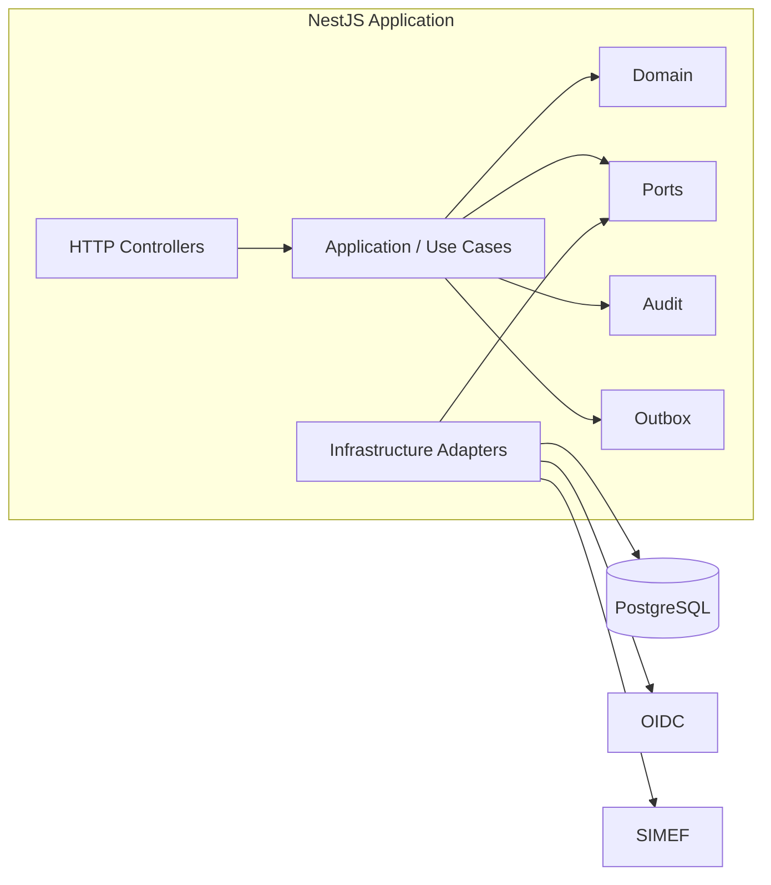

# ARC-005 — Backend Component Architecture

```mermaid
flowchart LR
 subgraph API[NestJS Application]
   HTTP[HTTP Controllers]
   APP[Application / Use Cases]
   DOM[Domain]
   PORTS[Ports]
   INFRA[Infrastructure Adapters]
   AUD[Audit]
   OUT[Outbox]
 end
 DB[(PostgreSQL)]
 IDP[OIDC]
 EXT[SIMEF]

 HTTP --> APP
 APP --> DOM
 APP --> PORTS
 INFRA --> PORTS
 INFRA --> DB
 INFRA --> IDP
 INFRA --> EXT
 APP --> AUD
 APP --> OUT
```

Controllers no contienen reglas de negocio. Repositories implementan ports definidos hacia el interior.
