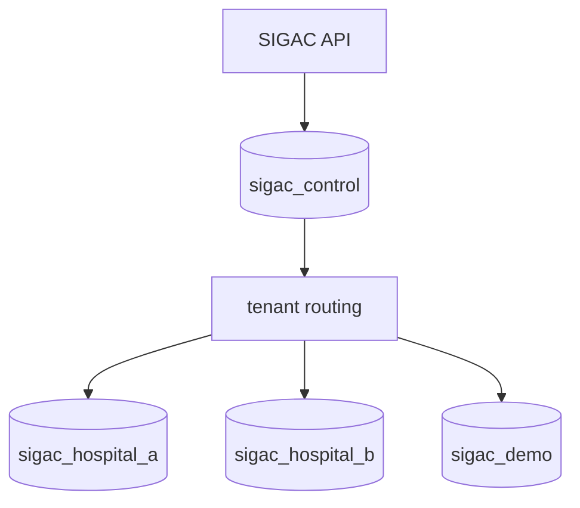

# ARC-012 — Multi-Tenancy Architecture

## Decision
**Control plane + database-per-tenant (logical database) for operational business data.**

A PostgreSQL cluster may host multiple tenant databases, but each hospital's operational data resides in its own database.

## Rationale
- strong isolation;
- simpler per-hospital backup/restore;
- reduced risk of cross-tenant query mistakes;
- supports different maintenance windows/configuration;
- DEMO separation is natural.

## Defense-in-depth
Where shared tables are unavoidable, PostgreSQL Row-Level Security may be used in addition to application checks, not instead of isolation.

## Cost
More database lifecycle/migration automation is required.

## TenantDatabaseRouter

`packages/platform/database` resuelve pools exclusivamente desde TenantContext validado
y un registro allow-listed. No autoriza actores, no recibe rutas desde HTTP y no expone
tipos PostgreSQL/Drizzle a Application. Una operación mutante abre como máximo una
transacción en una única database tenant; no hay transacciones cross-tenant.
