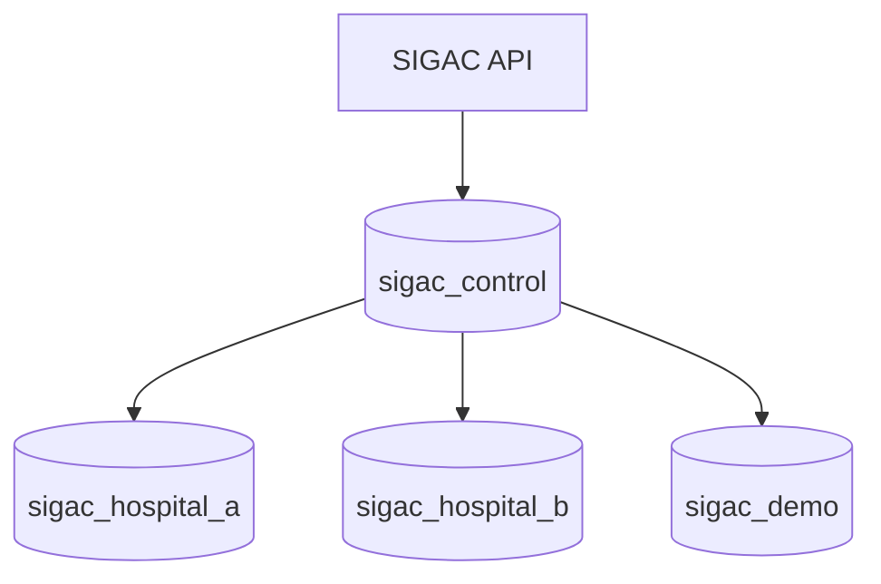

# DAT-002 — Database Topology

## Control DB
Tenant registry, routing, global configuration mínima y estado de migraciones.

## Tenant DB
Expedientes, solicitudes, preparación, préstamos, incidencias, movimientos, auditoría, outbox y catálogos propios.
