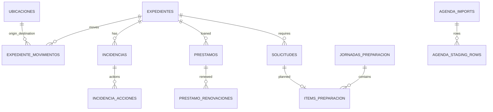

# DAT-028 — ERD

```mermaid
erDiagram
  EXPEDIENTES ||--o{ SOLICITUDES : requires
  EXPEDIENTES ||--o{ PRESTAMOS : loaned
  EXPEDIENTES ||--o{ INCIDENCIAS : has
  EXPEDIENTES ||--o{ EXPEDIENTE_MOVIMIENTOS : moves
  JORNADAS_PREPARACION ||--o{ ITEMS_PREPARACION : contains
  SOLICITUDES ||--o| ITEMS_PREPARACION : planned
  PRESTAMOS ||--o{ PRESTAMO_RENOVACIONES : renewed
  INCIDENCIAS ||--o{ INCIDENCIA_ACCIONES : actions
  AGENDA_IMPORTS ||--o{ AGENDA_STAGING_ROWS : rows
  UBICACIONES ||--o{ EXPEDIENTE_MOVIMIENTOS : origin_destination
```

Conceptual physical ERD; fields documented separately.
