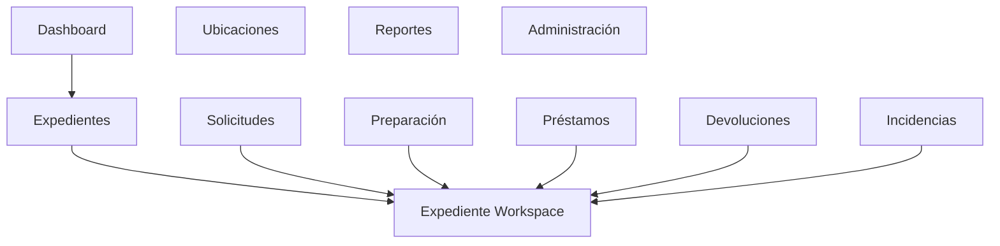

# IA-001 — Sitemap

```mermaid
flowchart TD
 D[Dashboard]
 E[Expedientes]
 S[Solicitudes]
 P[Preparación]
 L[Préstamos]
 R[Devoluciones]
 I[Incidencias]
 U[Ubicaciones]
 REP[Reportes]
 A[Administración]
 D --> E
 E --> EW[Expediente Workspace]
 S --> EW
 P --> EW
 L --> EW
 R --> EW
 I --> EW
```
